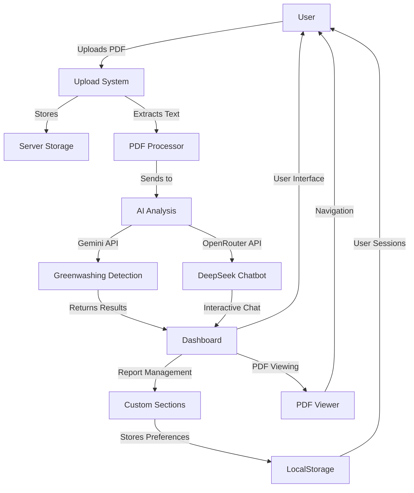
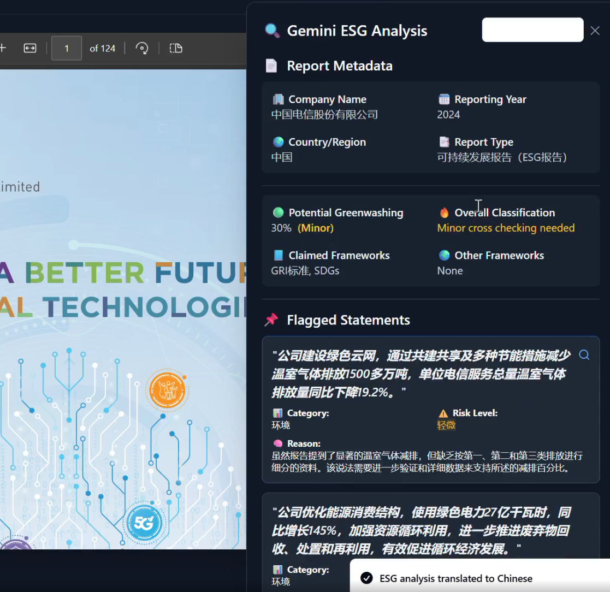
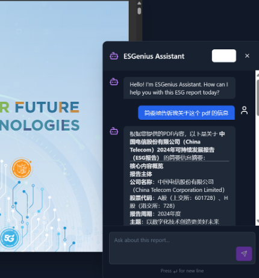
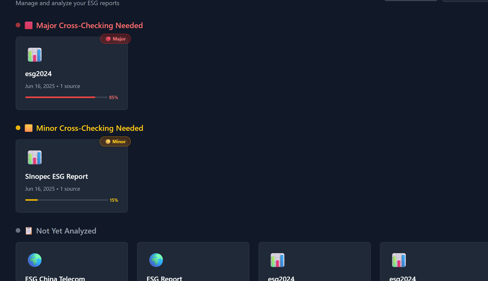

# 🧠 ESGenius | ESG慧眼 *(Huì YǍn)*

> *"Seeing through the green."*

**ESGenius** is an intelligent ESG (Environmental, Social, and Governance) report analysis platform that streamlines validation and compliance for sustainability professionals. Built for high-stakes transparency and aligned with China's 2060 carbon neutrality vision, ESGenius empowers analysts, auditors, and investors to quickly detect greenwashing, validate ESG claims, and accelerate impact.


[See Video Demo](https://drive.google.com/file/d/1eNWfeRM2GADh3a-6_WLPWRb_gROq_z3W/view?usp=sharing)

---

## 🌟 Features

* 📄 **PDF Upload & Management**: Easily upload, organize, and access ESG reports
* 🤖 **AI-Powered Greenwashing Detection**: Uncover vague, unsupported, or misleading sustainability claims
* 🔍 **Interactive PDF Viewer**: Seamless report navigation with full-text search
* 🚩 **Flagged Statement Highlighting**: One-click access to concerning content with ESG category and rationale
* 💬 **Intelligent Chatbot (DeepSeek)**: Ask contextual questions, get real-time insights and section summaries
* 📊 **Framework Detection**: Detect claimed ESG frameworks (GRI, SASB, TCFD, etc.) via full-text search
* 🧾 **Metadata Extraction**: Auto-detect company name, report year, report scope, and key ESG metrics
* 💾 **Persistent Storage**: All uploaded reports and AI results are saved and accessible anytime
* 📁 **Custom Section Management**: Create and manage your own sections to organize reports
* 🗑️ **Report Management**: Add reports to sections, remove from sections, or delete them entirely
* 📊 **Custom Greenwashing Score**: Intelligent scoring based on Major/Minor issues with weighted percentages
* 🔄 **Persistent User Preferences**: Save user sections and organization choices with localStorage

---

## 🚀 Tech Stack

* **Frontend**: React, TypeScript, Vite, Tailwind CSS, shadcn/ui
* **Backend**: Node.js, Express
* **PDF Processing**: PDF.js for client-side rendering & extraction
* **AI Models**:

  * **Gemini 1.5 Flash** — ESG analysis and greenwashing detection
  * **DeepSeek** — Conversational ESG report assistant via OpenRouter
* **Storage**: LocalStorage for user preferences, Server-side storage for reports

---

## 🧠 AI Integration

### Gemini 2.5 Pro

Gemini scans ESG reports to:

* Detect greenwashing, vague claims, or omissions
* Identify Environmental, Social, and Governance issue categories
* Extract report metadata and claimed ESG frameworks

### DeepSeek R1 (via OpenRouter)

Use the built-in chatbot to:

* Summarize ESG sections
* Clarify terms and methodologies
* Verify statements based on report content
* Compare standards and evaluate compliance

---

## 🔄 System Architecture



## 🛠️ Installation & Setup

### Prerequisites

* Node.js (v14 or higher)
* npm or yarn

### Setup Steps

1. Clone the repository:

```bash
git clone https://github.com/kavirtudez/ESGenius.git
cd ESGenius
```

2. Install dependencies:

```bash
npm install
```

3. Create `.env` file in the root directory:

```env
GEMINI_API_KEY=your_gemini_api_key
OPENROUTER_API_KEY=your_openrouter_api_key
```

4. Start backend server:

```bash
npm run server
```

5. Start frontend development server:

```bash
npm run dev
```

6. Visit `http://localhost:8080` in your browser

---

## 📊 Usage Guide

### Upload & Analyze a Report

1. Click "Create New"
2. Upload your ESG PDF
3. Enter title and category
4. Click "Analyze with Gemini"
5. View confidence score, issue classification, and flagged statements
6. Navigate directly to red-flagged content inside the viewer
7. Translate to Chinese if needed
   


### Ask ESG Questions

1. Click the chatbot icon in viewer
2. Ask things like:

   * "What frameworks are used in this report?"
   * "Is the carbon neutrality claim supported?"
   * "Summarize the environmental section"
   * "What ESG category does this issue fall under?"
3. Chat is multilingual, so Chinese conversations are easily possible.




   
### Manage Custom Sections

1. Click the three-dot menu on any report card
2. Select "Add to Section"
3. Choose an existing section or create a new one
4. View your custom sections in the dashboard sidebar
5. Remove reports from sections using the three-dot menu



---

## 🎯 Target Audience

ESGenius is crafted for:

* Sustainability analysts 📈
* ESG auditors & compliance officers 📆
* Impact investors 📉
* Policy and regulatory researchers 🏢

Whether reviewing 10 pages or 300, ESGenius accelerates truth-based ESG insights while freeing professionals from manual review.

---

## 🏆 Competition Entry

This project is an entry to the **Southeast Asia Division Contest of China International College Students' Innovation Competition 2025 (SEA-CICSIC 2025)**.

Aligned with China's 2060 Carbon Neutrality Goal — ESGenius supports data-driven, intelligent governance for a sustainable future.

---

## 📄 License

[MIT License](LICENSE)

---

## 🙏 Acknowledgements

* [Gemini AI](https://ai.google.dev/) — ESG audit capabilities
* [DeepSeek AI](https://www.deepseek.ai/) — Conversational search
* [OpenRouter](https://openrouter.ai/) — AI model access management
* [PDF.js](https://mozilla.github.io/pdf.js/) — PDF rendering
* [shadcn/ui](https://ui.shadcn.com/) — UI components
* [Tailwind CSS](https://tailwindcss.com/) — Styling

---

Created with 💚 for a transparent, greener tomorrow.
